# window-function

Complete, encyclopedic collection of window functions for signal processing and spectral analysis.

**34 window functions** in a single file. Zero dependencies. Pure ESM.

Covers every window function in scipy.signal.windows, MATLAB Signal Processing Toolbox, Harris (1978) "On the Use of Windows for Harmonic Analysis with the DFT", and the Wikipedia "Window function" article — plus scientific niche windows used in FTIR spectroscopy (Connes), gravitational wave detection (Planck-taper), audio codecs (KBD), multitaper estimation (DPSS), antenna design (Ultraspherical), and time-frequency optimization (Confined Gaussian).


## Why so many windows?

Every window is a tradeoff. You can optimize for:

- **Frequency resolution** — narrow main lobe, distinguish close frequencies
- **Spectral leakage** — low sidelobes, weak signals aren't masked by strong ones
- **Amplitude accuracy** — flat main lobe top, measured amplitudes are correct

No single window optimizes all three. The rectangular window has the best resolution but worst leakage (-13 dB). The flat-top has the best amplitude accuracy but worst resolution. The Hann window is the go-to general-purpose compromise. Everything else exists because different measurement contexts shift the tradeoff.

## Usage

```js
import { hann, kaiser, generate, apply } from 'window-function'

hann(50, 101)                   // → 1.0 (single sample)
generate(hann, 1024)            // → Float64Array(1024)
generate(kaiser, 1024, 8.6)    // → parameterized window
apply(signal, kaiser, 8.6)     // → signal, windowed in-place
```

Compare windows quantitatively:

```js
import { hann, blackmanHarris, enbw, scallopLoss, cola } from 'window-function'

enbw(hann, 1024)                // → 1.5 (noise bandwidth in bins)
scallopLoss(hann, 1024)         // → 1.42 dB (worst-case amplitude error)
cola(hann, 1024, 512)           // → 0 (perfect STFT reconstruction at 50% overlap)
```

## API

Every window: `fn(i, N, ...params) → number` — sample `i` of window length `N`.

| Function | Parameters | Returns |
|---|---|---|
| `generate(fn, N, ...params)` | window function, length, params | `Float64Array` |
| `apply(signal, fn, ...params)` | signal array, window function, params | `signal` (modified) |
| `enbw(fn, N, ...params)` | window function, length, params | Equivalent noise bandwidth (bins) |
| `scallopLoss(fn, N, ...params)` | window function, length, params | Worst-case amplitude error (dB) |
| `cola(fn, N, hop, ...params)` | window function, length, hop, params | COLA deviation (0 = perfect) |

## Complete Window Reference

### Simple — no parameters

| Window | Peak sidelobe | Rolloff | What it does | When to use |
|---|---|---|---|---|
| `rectangular` | -13 dB | -6 dB/oct | No windowing at all | Transient signals already zero at edges; harmonic analysis with integer cycles |
| `triangular` | -27 dB | -12 dB/oct | Linear taper, nonzero endpoints | Simple smoothing, 2nd-order B-spline |
| `bartlett` | -27 dB | -12 dB/oct | Linear taper, zero endpoints | Bartlett's method PSD estimation. Bartlett 1950 |
| `welch` | -21 dB | -12 dB/oct | Parabolic taper | Welch's method PSD estimation. Welch 1967 |
| `connes` | — | -24 dB/oct | Welch squared (4th power parabolic) | FTIR spectroscopy, interferogram apodization. Connes 1961 |
| `hann` | -32 dB | -18 dB/oct | Raised cosine, zero endpoints | General-purpose spectral analysis, STFT with 50% overlap (COLA). The default choice. Blackman & Tukey 1958 |
| `hamming` | -43 dB | -6 dB/oct | Raised cosine, nonzero endpoints | FIR filter design (window method), speech processing. Hamming 1977 |
| `cosine` | -23 dB | -12 dB/oct | Half-period sine | MDCT audio codecs: MP3, AAC, Vorbis. Princen & Bradley 1987 |
| `blackman` | -58 dB | -18 dB/oct | 3-term cosine sum | Spectral analysis needing better leakage than Hann. Blackman & Tukey 1958 |
| `exactBlackman` | -69 dB | -6 dB/oct | Blackman with exact zero placement | Precision analysis, zeros at 3rd/4th sidelobes. Harris 1978 |
| `nuttall` | -93 dB | -18 dB/oct | 4-term, continuous 1st derivative | High-dynamic-range analysis without edge discontinuity. Nuttall 1981 |
| `blackmanNuttall` | -98 dB | -6 dB/oct | 4-term, lowest sidelobes | Maximum sidelobe suppression among 4-term windows. Nuttall 1981 |
| `blackmanHarris` | -92 dB | -6 dB/oct | 4-term, minimum sidelobe | ADC testing, measurement instrumentation, >80 dB dynamic range. Harris 1978 |
| `flatTop` | -93 dB | -6 dB/oct | 5-term, near-zero scalloping. Peak ~4.64 | Amplitude calibration, transducer calibration (~0.01 dB accuracy). ISO 18431. Heinzel 2002 |
| `bartlettHann` | -36 dB | — | Bartlett × Hann hybrid | Balanced near/far sidelobe levels. Ha & Pearce 1989 |
| `lanczos` | -26 dB | — | Sinc main lobe | Image resampling, interpolation (FFmpeg, ImageMagick). Duchon 1979 |
| `parzen` | -53 dB | -24 dB/oct | 4th-order B-spline | Kernel density estimation, always-positive spectrum. Parzen 1961 |
| `bohman` | -46 dB | -24 dB/oct | Autocorrelation of cosine window | Fast sidelobe decay, spectral estimation |

<p align="center">
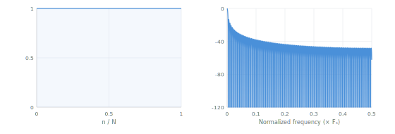
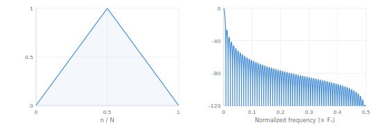
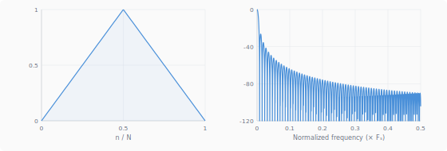
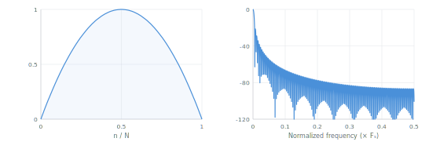
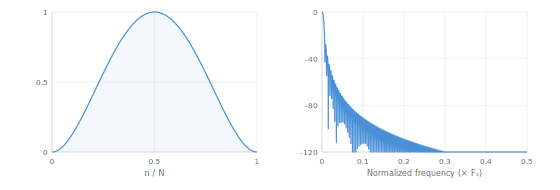
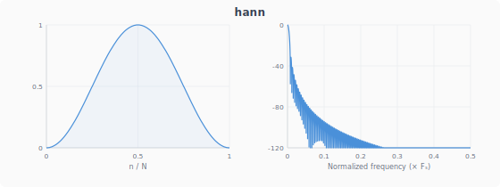
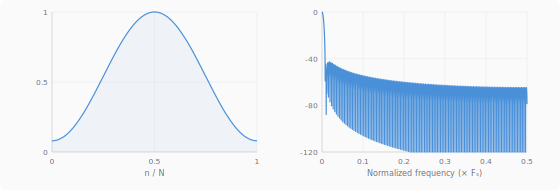
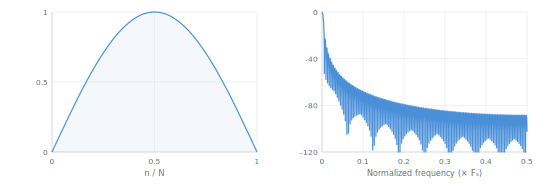
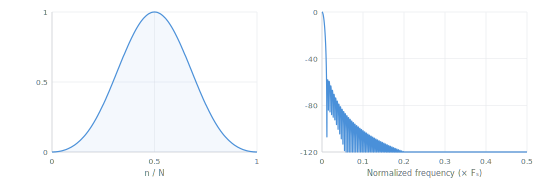
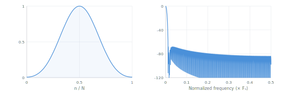

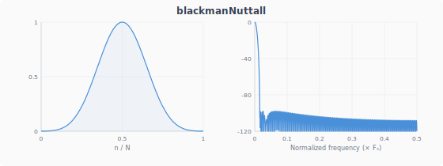
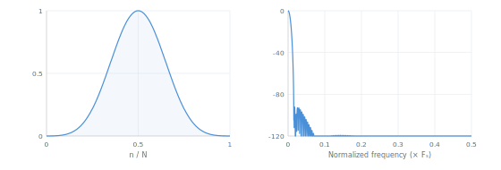
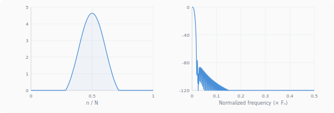
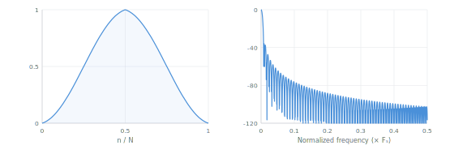
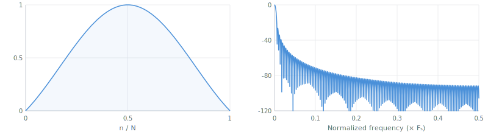
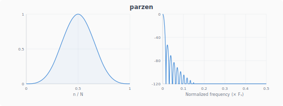
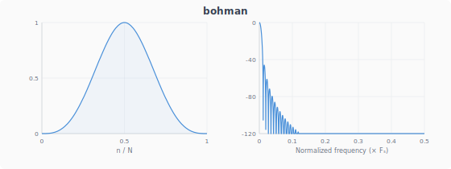
</p>

<details>
<summary>Formulas</summary>

$$w(n) = 1 \quad \text{(rectangular)}$$

$$w(n) = 1 - \left|\frac{2n - N + 1}{N}\right| \quad \text{(triangular)}$$

$$w(n) = 1 - \left|\frac{2n - N + 1}{N - 1}\right| \quad \text{(bartlett)}$$

$$w(n) = 1 - \left(\frac{2n - N + 1}{N - 1}\right)^2 \quad \text{(welch)}$$

$$w(n) = \left[1 - \left(\frac{2n - N + 1}{N - 1}\right)^2\right]^2 \quad \text{(connes)}$$

$$w(n) = 0.5 - 0.5\cos\!\left(\frac{2\pi n}{N-1}\right) \quad \text{(hann)}$$

$$w(n) = 0.54 - 0.46\cos\!\left(\frac{2\pi n}{N-1}\right) \quad \text{(hamming)}$$

$$w(n) = \sin\!\left(\frac{\pi n}{N-1}\right) \quad \text{(cosine)}$$

$$w(n) = \sum_{k=0}^{K} (-1)^k\, a_k \cos\!\left(\frac{2\pi k n}{N-1}\right) \quad \text{(cosine-sum family: blackman, nuttall, etc.)}$$

$$w(n) = 0.62 - 0.48\left|\frac{n}{N-1} - 0.5\right| - 0.38\cos\!\left(\frac{2\pi n}{N-1}\right) \quad \text{(bartlettHann)}$$

$$w(n) = \operatorname{sinc}\!\left(\frac{2n}{N-1} - 1\right) \quad \text{(lanczos)}$$

$$w(n) = \begin{cases} 1 - 6a^2(1-a) & |a| \le 0.5 \\ 2(1-a)^3 & |a| > 0.5 \end{cases},\quad a = \left|\frac{2n-N+1}{N-1}\right| \quad \text{(parzen)}$$

$$w(n) = (1-|a|)\cos(\pi|a|) + \frac{\sin(\pi|a|)}{\pi},\quad a = \frac{2n-N+1}{N-1} \quad \text{(bohman)}$$

</details>

### Parameterized — adjustable tradeoff

| Window | Parameters | What it does | When to use |
|---|---|---|---|
| `kaiser(i, N, beta)` | `beta`: 0→rect, 5.4→Hamming, 8.6→Blackman | Near-optimal DPSS approximation via Bessel I0 | FIR filter design — the standard parameterized window. Kaiser 1974 |
| `gaussian(i, N, sigma)` | `sigma`: width, default 0.4 | Gaussian bell, minimum time-bandwidth product | STFT/Gabor transform, frequency estimation via parabolic interpolation. Gabor 1946 |
| `generalizedNormal(i, N, sigma, p)` | `sigma`, `p`: shape (2=Gaussian, →∞=rect) | Continuous family between Gaussian and rectangular | Adjustable time-frequency tradeoff, controllable flat-top width |
| `tukey(i, N, alpha)` | `alpha`: 0→rect, 1→Hann | Flat center with cosine-tapered edges | Preserving signal amplitude while tapering edges. Vibration analysis, LIGO |
| `planckTaper(i, N, epsilon)` | `epsilon`: taper fraction, default 0.1 | C∞-smooth bump function (infinitely differentiable) | Gravitational wave analysis (LIGO/Virgo). McKechan 2010 |
| `powerOfSine(i, N, alpha)` | `alpha`: 0→rect, 1→cosine, 2→Hann | `sin^α` family | Codec design, parameterized spectral analysis |
| `exponential(i, N, tau)` | `tau`: time constant, default 1 | Exponential decay from center | Modal analysis, impact testing (compensates underdamped responses). Harris 1978 |
| `hannPoisson(i, N, alpha)` | `alpha`: ≥2 → no sidelobes | Hann × exponential product | Frequency estimators using convex optimization — unique no-sidelobe property |
| `cauchy(i, N, alpha)` | `alpha`: width, default 3 | Lorentzian 1/(1+x²) shape | Spectroscopy (matches spectral line shapes). Harris 1978 |
| `rifeVincent(i, N, order)` | `order`: 1=Hann, 2, 3 | Cosine-sum optimized for sidelobe fall-off | Power grid harmonic analysis, interpolated DFT. Rife & Vincent 1970 |
| `confinedGaussian(i, N, sigmaT)` | `sigmaT`: temporal width, default 0.1 | Optimal RMS time-frequency bandwidth | Time-frequency analysis, audio coding (MP3/AAC). Starosielec 2014 |

<p align="center">
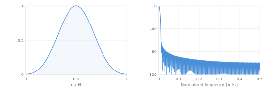
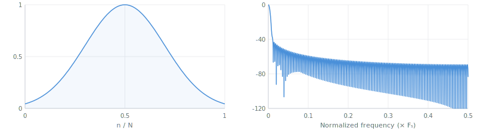

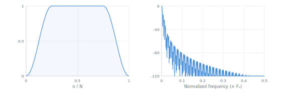
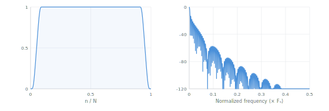
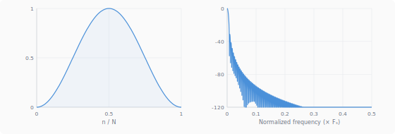
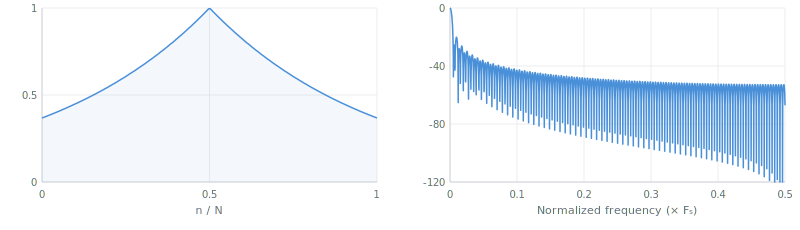
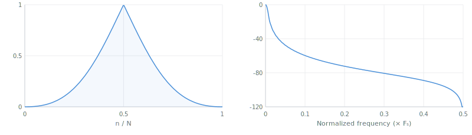
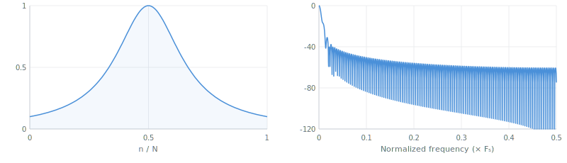

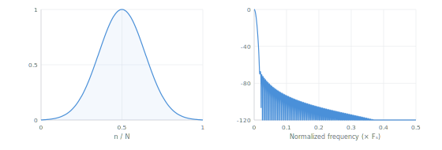
</p>

<details>
<summary>Formulas</summary>

$$w(n) = \frac{I_0\!\left(\beta\sqrt{1 - \left(\frac{2n-N+1}{N-1}\right)^2}\right)}{I_0(\beta)} \quad \text{(kaiser)}$$

$$w(n) = \exp\!\left[-\frac{1}{2}\left(\frac{2n-N+1}{\sigma(N-1)}\right)^2\right] \quad \text{(gaussian)}$$

$$w(n) = \exp\!\left[-\frac{1}{2}\left|\frac{2n-N+1}{\sigma(N-1)}\right|^p\right] \quad \text{(generalizedNormal)}$$

$$w(n) = \begin{cases} \frac{1}{2}\left[1+\cos\!\left(\pi\!\left(\frac{n}{\alpha(N-1)/2}-1\right)\right)\right] & n \le \frac{\alpha(N-1)}{2} \\ 1 & \text{center} \\ \text{symmetric} & n \ge N-1-\frac{\alpha(N-1)}{2} \end{cases} \quad \text{(tukey)}$$

$$w(n) = \sin^\alpha\!\left(\frac{\pi n}{N-1}\right) \quad \text{(powerOfSine)}$$

$$w(n) = \exp\!\left(\frac{-|2n-N+1|}{\tau(N-1)}\right) \quad \text{(exponential)}$$

$$w(n) = \frac{1}{2}\left(1-\cos\frac{2\pi n}{N-1}\right)\exp\!\left(\frac{-\alpha|2n-N+1|}{N-1}\right) \quad \text{(hannPoisson)}$$

$$w(n) = \frac{1}{1+\left(\frac{\alpha(2n-N+1)}{N-1}\right)^2} \quad \text{(cauchy)}$$

$$w(n) = \frac{1}{Z}\sum_{k=0}^{K}(-1)^k a_k\cos\frac{2\pi kn}{N-1} \quad \text{(rifeVincent, class I)}$$

</details>

### Array-computed — require full-window computation (cached)

| Window | Parameters | What it does | When to use |
|---|---|---|---|
| `dolphChebyshev(i, N, dB)` | `dB`: sidelobe attenuation, default 100 | Optimal: narrowest main lobe for given equiripple sidelobe level | Antenna array design, radar beam patterns. Dolph 1946 |
| `taylor(i, N, nbar, sll)` | `nbar`: constant lobes (4), `sll`: level dB (30) | Dolph-Chebyshev variant with monotonically decreasing sidelobes | Radar, SAR image formation — the radar community standard. Taylor 1955 |
| `kaiserBesselDerived(i, N, beta)` | `beta`: shape, default 8.6. N must be even | Princen-Bradley condition for perfect MDCT reconstruction | AAC, Vorbis, Opus audio codecs (long blocks). Princen & Bradley 1987 |
| `dpss(i, N, W)` | `W`: half-bandwidth [0, 0.5], default 0.1 | Provably optimal energy concentration in frequency band | Thomson multitaper spectral estimation, neuroscience (EEG/MEG), climate science. Slepian 1978 |
| `ultraspherical(i, N, mu, xmu)` | `mu`: 0→Dolph-Cheb, 1→Saramaki; `xmu`: sidelobe control | Gegenbauer polynomial window — independent sidelobe level and taper rate | Advanced antenna design, beamforming. Streit 1984 |

<p align="center">
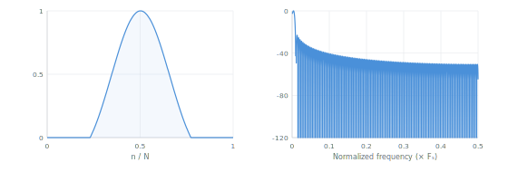
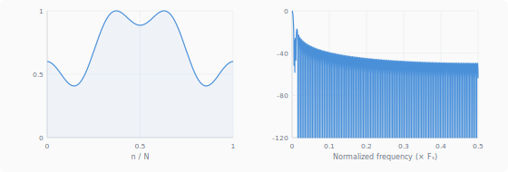
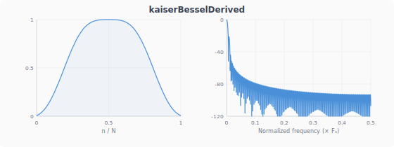
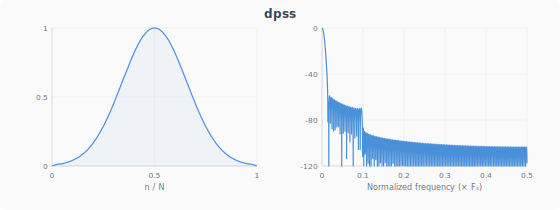

</p>

<details>
<summary>Formulas</summary>

$$W(k) = (-1)^k T_{N-1}\!\left(\beta\cos\frac{\pi k}{N}\right),\quad w = \operatorname{IDFT}(W) \quad \text{(dolphChebyshev)}$$

$$w(n) = 1 + 2\sum_{m=1}^{\bar{n}-1} F_m \cos\frac{2\pi m(n-(N-1)/2)}{N} \quad \text{(taylor)}$$

$$w(n) = \sqrt{\frac{\sum_{j=0}^{n} K(j)}{\sum_{j=0}^{N/2} K(j)}},\quad K(j) = I_0\!\left(\beta\sqrt{1-\left(\frac{2j-N/2}{N/2}\right)^2}\right) \quad \text{(kaiserBesselDerived)}$$

$$\mathbf{T}\mathbf{v} = \lambda\mathbf{v},\quad T_{jk} = \frac{\sin 2\pi W(j-k)}{\pi(j-k)} \quad \text{(dpss — dominant eigenvector)}$$

$$W(k) = C_n^\mu\!\left(x_\mu\cos\frac{\pi k}{N}\right),\quad w = \operatorname{IDFT}(W) \quad \text{(ultraspherical)}$$

</details>

## Which window should I pick?

| I need to... | Use | Why |
|---|---|---|
| Just get started | `hann` | Good all-round, zero edges, 50% COLA |
| Design FIR filters | `kaiser` or `hamming` | Kaiser is tunable, Hamming is the classic |
| Measure amplitudes accurately | `flatTop` | < 0.01 dB scalloping loss |
| High dynamic range (>80 dB) | `blackmanHarris` | -92 dB equiripple sidelobes |
| Audio codec (MDCT) | `kaiserBesselDerived` or `cosine` | Princen-Bradley perfect reconstruction |
| Preserve center, taper edges | `tukey` | Adjustable flat-top fraction |
| Robust spectral estimation | `dpss` | Optimal for multitaper method |
| Frequency estimation via optimization | `hannPoisson` | Monotonically decreasing (convex) transform |
| Radar / SAR | `taylor` | Monotonic sidelobes, radar standard |
| Antenna array design | `dolphChebyshev` or `ultraspherical` | Optimal equiripple or tunable taper |
| Tune resolution/leakage continuously | `kaiser` or `gaussian` | Single-parameter adjustment |
| Modal / impact analysis | `exponential` | Controlled decay for underdamped systems |
| FTIR spectroscopy | `connes` | Smooth apodization for interferograms |
| Gravitational waves | `planckTaper` | C∞ smooth, no spectral artifacts |

## Quantitative metrics

The decision tables above give qualitative guidance. These three functions let you verify and compare numerically:

- **ENBW** (Equivalent Noise Bandwidth) — how many frequency bins of noise power leak through the window. Rectangular = 1.0 (theoretical minimum), Hann = 1.5, Blackman-Harris = 2.0. Lower means less noise contaminates your measurement.

- **Scallop loss** — the worst-case amplitude error when a tone falls exactly between two DFT bins. Rectangular = 3.92 dB (worst), Hann = 1.42 dB, flat-top ≈ 0 dB (best). This is why flat-top windows exist: amplitude accuracy at the cost of frequency resolution.

- **COLA** (Constant Overlap-Add) — whether overlapping windows sum to a constant, which guarantees perfect STFT reconstruction. Returns 0 for perfect COLA. Hann at 50% overlap is the classic COLA pair.

## Migrating from v2

v3 is a complete rewrite: CJS → ESM, 20 files → 1, 18 → 34 windows.

```diff
- const hann = require('window-function/hann')
- const apply = require('window-function/apply')
+ import { hann, apply } from 'window-function'
```

The per-sample API (`fn(i, N, ...params) → number`) is unchanged.

## References

| Year | Reference | Windows |
|---|---|---|
| 1946 | Dolph, *Proc. IRE* 34 | Dolph-Chebyshev |
| 1946 | Gabor, *J. IEE* 93 | Gaussian |
| 1950 | Bartlett, *Biometrika* 37 | Bartlett |
| 1955 | Taylor, *IRE Trans. Antennas Propag.* AP-4 | Taylor |
| 1958 | Blackman & Tukey, *The Measurement of Power Spectra* | Hann, Blackman |
| 1961 | Connes, *Revue d'Optique* 40 | Connes |
| 1961 | Parzen, *Technometrics* 3 | Parzen |
| 1967 | Welch, *IEEE Trans. Audio Electroacoustics* AU-15 | Welch |
| 1970 | Rife & Vincent, *IEEE Trans. Instrumentation* | Rife-Vincent |
| 1974 | Kaiser, *IEEE Int. Symp. Circuits and Systems* | Kaiser |
| 1977 | Hamming, *Digital Filters* | Hamming |
| 1978 | Harris, *Proc. IEEE* 66 — **the comprehensive survey** | Blackman-Harris, survey of all |
| 1978 | Slepian, *Bell System Technical Journal* 57 | DPSS |
| 1979 | Duchon, *J. Applied Meteorology* 18 | Lanczos |
| 1981 | Nuttall, *IEEE Trans. ASSP* 29 | Nuttall, Blackman-Nuttall |
| 1984 | Streit, *IEEE Trans. ASSP* 32 | Ultraspherical |
| 1987 | Princen, Johnson & Bradley, *ICASSP* | KBD, Cosine |
| 1989 | Ha & Pearce, *IEEE* | Bartlett-Hann |
| 2002 | Heinzel, Rudiger & Schilling (ISO 18431) | Flat-top |
| 2010 | McKechan, Robinson & Sathyaprakash, *Class. Quantum Grav.* | Planck-taper |
| 2014 | Starosielec & Hagemeier, *Signal Processing* | Confined Gaussian |

## License

MIT • <a href="https://github.com/krishnized/license/">ॐ</a>
